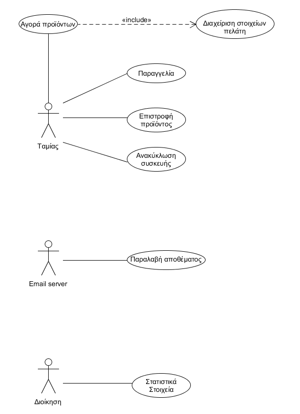
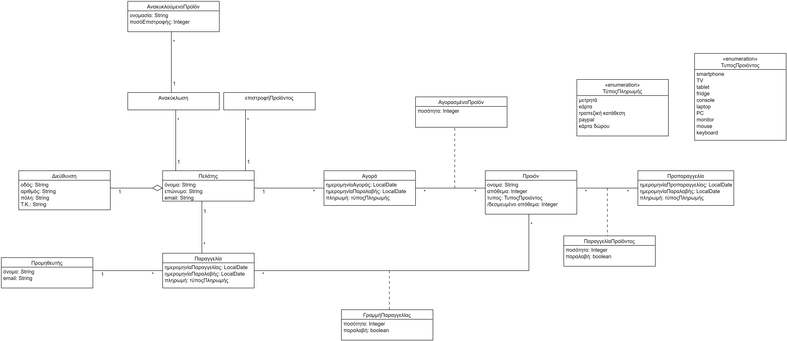
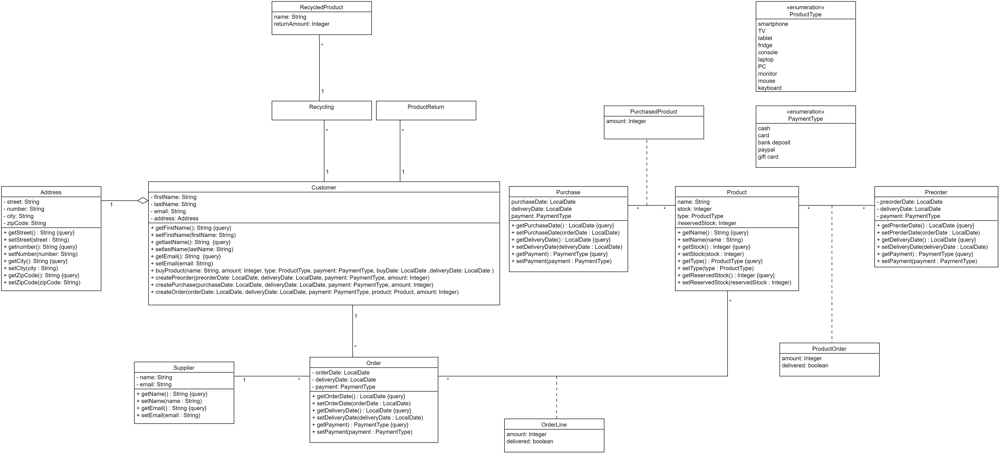

# Εισαγωγή

Αυτο το repository αφορά ενα λογισμικό για ταμία που θα βοηθά στην λειτουργία ενός καταστήματος Ηλεκτρονικών ειδών

## Απαιτήσεις Λογισμικού - Κατάστημα Ηλεκτρονικών Ειδών

Το σύστημα θα υποστηρίζει τα καθήκοντα του ταμία. Επίσης θα στέλνει ανημερωτικό σύστημα στους πελάτες. Θα ενημερώνει την διοίκηση με
στατιστικά στοιχεία. Και ο τεχνικός ενημερώνει το αρχείο προιόντων που βρίσκεται σε service.

#### Οι δυνατότητες του ταμεία:
Εγγράφει τους νέους πελάτες στο σύστημα.
Ολοκληρώνει ονομαστικές αγορές.
Διεκπεραιώνει αιτήματα επιστροφής και ανακύκλωσης συσκευών.
Δημιουργεί παραγγελίες προιόντων που βρίσκονται σε έλλειψη.

#### Ο πελάτης:
θα δέχεται μήνυμα για την ενημέρωση της παραγγελίας του από το σύστημα.

#### Η διοίκηση:
Θα ενημερώνεται μηνιαίως με στατιστικά που έχει παράξει το σύστημα.

#### Ο τεχνικός:
Θα ενημερώνει το σύστημα για το ποια προιόντα βρίσκονται σε service.

* Σε περίπτωση service εντός του χρόνου εγγύησης, ο πελάτης δεν επιβαρύνεται οικονομικά. Ο χρόνος εγγύησης θα υπολογίζεται από την ημερομηνία αγοράς του προϊόντος.
* Όλες οι αγορές θα γίνονται από εγγεγραμένους πελάτες. Εάν ο πελάτης είναι νέος, θα εγγράφεται από τον ταμία.
* Θα εκδίδεται πιστωτικό της συνολικής αξίας ενός προϊόντος, στην περίπτωση της επιστροφής του. Θα υπάρχει δυνατότητα ανακύκλωσης με έκδοση πιστωτικού τμήτος της αρχικής αξίας του προϊόντος.
* Το σύστημα στέλνει ειδοποίηση στον ταμία όταν το απόθεμα ενός προϊόντος πέσει κάτω από κάποιο προκαθορισμένο όριο.

## Επισκόπηση μοντέλου περιπτώσεων χρήσης

# Ειδικές Απαιτήσεις 

## Περιπτώσεις χρήσης

### Actors του συστήματος

- Ταμίας
- Email Server
- Διοίκηση

### Περιγραφές περιπτώσεων χρήσης

#### [ΠΧ1 Αγορά Προιόντος](docs/markdown/uc1-purchase-of-product.md)

#### [ΠΧ2 Παραγγελία](docs/markdown/uc2-order.md)

#### [ΠΧ3 Διαχείριση Στοιχείων Πελάτη](docs/markdown/uc3-customer-data-managment.md)

#### [ΠΧ4 Επιστροφή Προιόντος](docs/markdown/uc4-Product_Return.md)

#### [ΠΧ5 Ανακύκλωση Συσκευής](docs/markdown/uc5-Device_Recycle.md)

#### [ΠΧ6 Παραλαβή Προιόντος](docs/markdown/uc6-Stock receipt.md)

#### [ΠΧ7 Στατιστικά Στοιχεία](docs/markdown/uc7-Statistics.md)

## Συμπληρωματικές προδιαγραφές

### Ποιοτικά χαρακτηριστικά

#### Απόδοση

Θα πρέπει τα στατιστικά στοιχεία να βγαίνουν άμεσα και γενικά να ανταποκίνεται άμεσα το λογισμικό

#### Ευχρηστία

Πρέπει το λογισμικό να είναι εύκολο στην χρήση για την πραγματοποίηση των διάφορων λειτουργιών

#### Συντηρισιμότητα

Θα πρέπει να είναι σχεδιασμένο έτσι ωστε να μπορεί να συντηρηθεί εύκολα στο μέλλον πχ με προσθήκες νέων λειτουργιών

# Υποστηρικτικό υλικό

## Μοντέλο πεδίου

## Ανάλυση περιπτώσεων χρήσης
--------------------------

### Διαγραμμα Κλασεων

