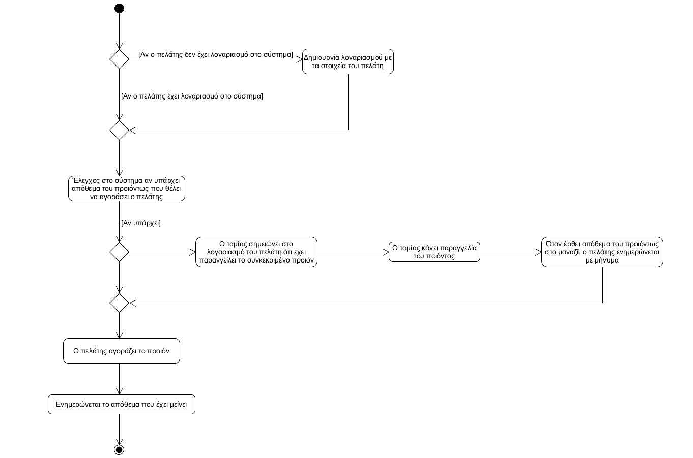

# ΠΧ1. Αγορά προιόντος

**Πρωτεύων Actor**: Ταμίας
**Ενδιαφερόμενοι**
**Ταμίας**: Θέλει να εξηπυρετήσει τον πελάτη στη αγορά ενός προιόντος.  
**Πελάτης**: Θέλει να αγοράσει ένα προιόν.  
**Προϋποθέσεις**: Να έχει δημιουργηθεί λογαριασμός πελάτη.

## Βασική Ροή

### Α) Δημιουργία αγοράς
1. Αναζήτηση λογαριασμού πελάτη
2. Το σύστημα εμφανίζει τον λογαριασμό του πελάτη.
3. Ο ταμίας αναζητά το απόθεμα του προιόντος που θέλει να αγοράσει ο πελάτης.
4. Το σύστημα εμφανίζει το απόθεμα.
5. Ο ταμίας ανανεώνει το απόθεμα.
6. Το σύστημα εμφανίζει το καινούριο απόθεμα

**Εναλλακτικές Ροές**

*1α. Ο ταμίας δεν βρίσκει τον λογαριασμό του πελάτη.*
1. Ο ταμίας δημιουργεί καινούριο λιογαριασμό.
2. Το σύστημα εμφανίζει τον καινούριο λογαριασμό.

*2α. Το απόθεμα δεν φτάνει.*
1. Ο ταμίας δημιουργεί παραγγελία στον λογαριασμό του πελάτη.
2. Το σύστημα εμφανίζει την παραγγελία και τερματίζεται η βασική ροή.

## Διαγραμμα Δραστηριοτητας

