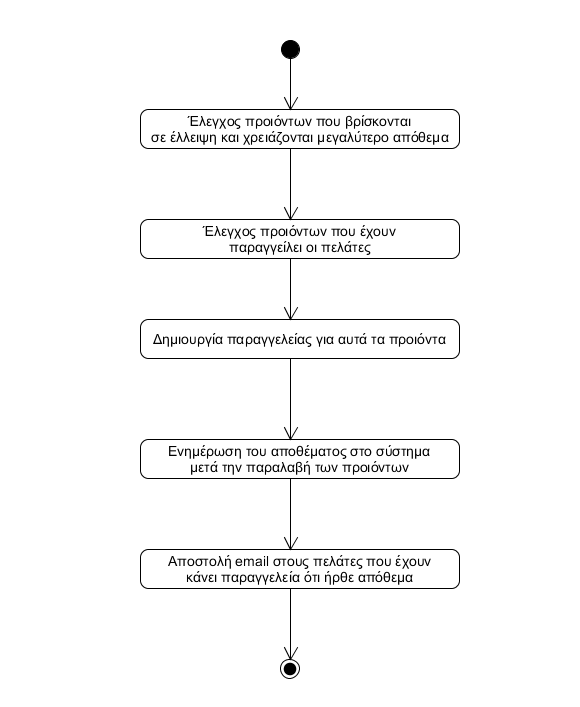

# ΠΧ2. Παραγγελία

**Πρωτεύων Actor**: Ταμίας
**Ενδιαφερόμενοι**
**Ταμίας**: Θέλει να παραγγείλει απόθεμα.  
**Προμιθευτές**: Προμιθεύει με προιόντα το κατάστημα.  
**Προϋποθέσεις**: Δεν υπάρχουν.

## Βασική Ροή

### Α) Δημιουργεία παραγγελείας

1. Ο ταμίας αναζητά τι παραγγελίες έχουν γίνει.
2. Το σύστημα εμφανίζει τις παργγελείες που έχουν γίνει.
3. Ο ταμίας αναζητά ποια προιόντα έχουν χαμηλό απόθεμα.
4. Το σύστημα εμφανίζει το προινόντα με το χαμηλό απόθεμα.

**Εναλλακτικές Ροές**

*1α. Δεν υπάρχει προιον για το οποιο να χρειάζεται να γίνει παραγγελία.*
1. Δεν χρειάζεται να γίνει παραγγελία και η περίπτωση χρήσης τερματίζει.

## Διαγραμμα Δραστηριοτητας

